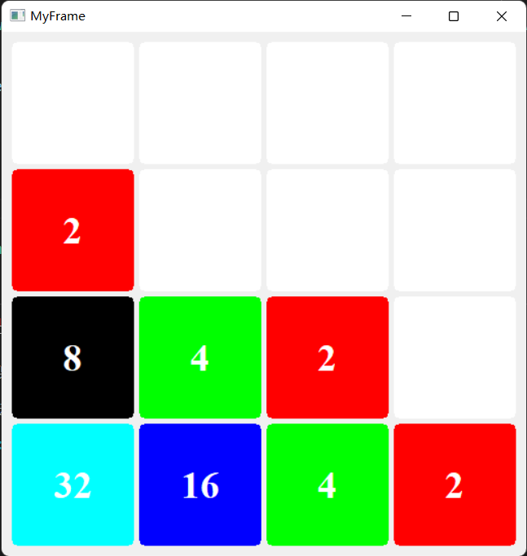

一个简单的 2048 小游戏，使用 wxWidgets 构建，其中 ScorePad.cpp 文件示例了如何自定义一个 
wxWidgets 控件。

## 从源码构建

1. 下载 wxWidgets 源码压缩包，并构建之，构建的时候需要更改 C/C++ 标准库的链接方式，选择静态链接.
2. 构建好之后，设置环境变量 `WXWIN` 为源码根目录
3. vscode 安装微软的 `CMake Tools` 插件。
4. 打开源码，配置工程，构建之。

## 运行

